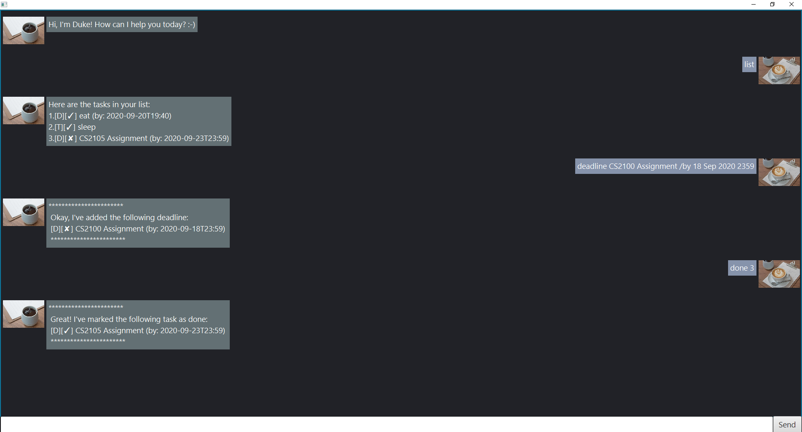

# Duke User Guide

## Features
Duke is a personal task manager. It allows users to view, add, delete and search for tasks.
Duke comes with a Graphical User Interface and provides some quality of life features as well, including
the ability to undo changes.



## Feature 1 
Add a Todo task.

### Usage

#### `todo DESCRIPTION` - Adds a Todo task

Adds a basic Todo task to the task list.

Example of usage: 

`todo go to the gym`

Expected outcome:

```
***********************

Okay! I've added the following task:
[T][✘] go to the gym

***********************
```

## Feature 2
Add a Deadline.

### Usage

#### `deadline DESCRIPTION /by DATETIME` - Adds a Deadline.

Adds a Deadline task to the task list.

Example of usage: 

`deadline Assignment /by 15 Sep 2020 2359`

Expected outcome:

```
***********************

Okay! I've added the following deadline:
[D][✘] Assignment (by: 2020-09-15T23:59)

***********************
```

## Feature 3
Add a Event.

### Usage

#### `event DESCRIPTION /by DATETIME` - Adds an Event.

Adds an Event task to the task list.

Example of usage: 

`event Birthday party /at 16 Sep 2020 2000`

Expected outcome:

```
***********************

Okay! I've added the following event:
[E][✘] Birthday party (at: 2020-09-16T20:00)

***********************
```

## Feature 4
Mark a task as completed.

### Usage

#### `done TASKNUMBER` - Marks a task as completed.

Mark a task in the task list as completed .

Example of usage: 

`done 1`

Expected outcome:

```
***********************

Great! I've marked the following task as done:
[T][✓] go to the gym

***********************
```

## Feature 5
Delete a task.

### Usage

#### `delete TASKNUMBER` - Deletes a task

Deletes a task from the task list.

Example of usage: 

`delete 1`

Expected outcome:

```
***********************

Okay, I've deleted the following task:
[T][✓] go to the gym

***********************
```

## Feature 6
View all tasks

### Usage

#### `list` - Lists all tasks

Lists all the tasks in the task list.

Example of usage: 

`list`

Expected outcome:

```
Here are the tasks in your list:
1.[D][✘] Assignment (by: 2020-09-15T23:59)
2.[E][✘] Birthday party (at: 2020-09-16T20:00)
```

## Feature 7
Find tasks by keyword

### Usage

#### `find KEYWORD` - Find tasks containing keyword

Searches for and lists the tasks in the task list containing a given keyword.

Example of usage: 

`find Assignment`

Expected outcome:

```
***********************

Here are the matching tasks in your list:
1.[D][✘] Assignment (by: 2020-09-15T23:59)
2.[D][✘] CS2105 Assignment (by: 2020-09-23T23:59)

***********************
```

## Feature 8
Undo previous commands

### Usage

#### `undo` - undo the most recent command

Undos the most recent command. Commands which did not change the task list 
such as `list` and `find` will not be considered when deciding the most
recent command. 
<p>
Undo can be used multiple times sequentially to undo multiple commands. 
However, once you close the application , the commands made during that 
session will not be undoable.
</p>

Example of usage: 

`done 1` > `undo` > `list`

Expected outcome:

`done 1` Mark task 1 as done:
```
***********************

Great! I've marked the following task as done:
[T][✓] go to the gym

***********************

```
`undo` Undo previous `done 1` command:
```
Undo previous command!
```

`list` Verify `done` command undone:
```
Here are the tasks in your list:
1.[T][✘] go to the gym
```

## Feature 9
Exit application

### Usage

#### `bye` - Exits the application

Exits the application.

Example of usage: 

`bye`

Expected outcome:

```
***********************

Bye! See you again soon! :-)

***********************

[Application Exits, User Interface clsoes]
```


